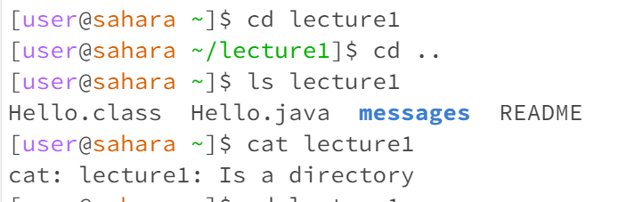
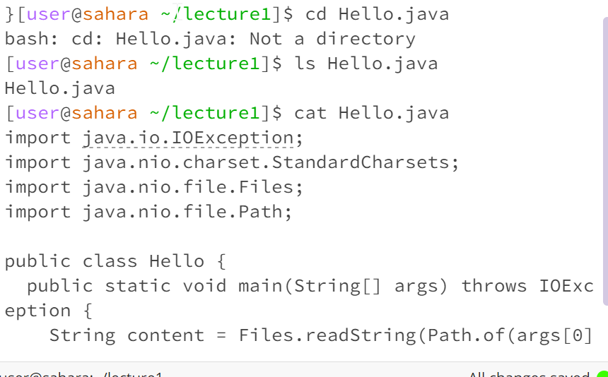

# Lab1
## No argument:

## cd
- Working directory: /home
- Nothing happened because cd is used to change the directory. So with no directory to go to, nothing happens
- No error, as our command was correct, though nothing happened

## ls
- Working directory:/home
- It printed a list of the files that existed on the /home directory. This is because ls is used to list the contents of a directory. So When using it without an argument, it lists the contents of the current directory.
- No error, as we used it correctly.

## cat
- Working directory:/home
- No output. However. It stopped me from typing commands in the terminal and instead duplicated whatever I typed. This might be because as cat is used to print the contents of a file, it duplicates what you type instead when given an empty argument
- No error

## Directory as an argument (lecture1)

## cd
- working directory:/home
- The command changed my working directory to lecture1. This is because cd changes directory, so it changed it to the one we specified.
- No error

## ls
- working directory:/home
- It printed the files inside lecture1 directory. This is because ls lists the files of a directory and as we gave it a certain directory, it listed its files.
- No error

## cat
- working directory:/home
- The output is: cat: lecture1: Is a directory. It printed the file and its purpose.
- No error

## File as an argument (Hello.java)

## cd
- working directory:/home/lecture1
- here is the output: bash: cd: Hello.java: Not a directory. (It is telling us that the java file is not a directory)
- It is an error because we are trying to access a file that cannot be used as a directory.

## ls
- working directory:/home/lecture1
- It printed the file name (Hello.java). This is because we are only giving ls a single file, so it is only printing its name.
- No error

## cat
- working directory:/home/lecture1
- It printed all content inside the file. This is because that is the use case for cat, which is printing the contents of files.
- No error

