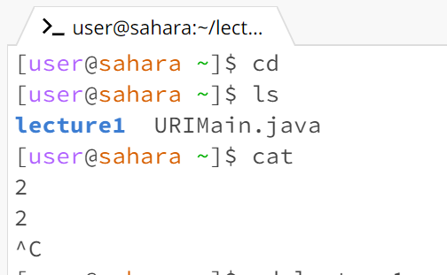

# Lab1
No argument:

## cd
- Working directory: /home
- Nothing happened.
- No error

## ls
- Working directory:/home
- It printed a list of the files that existed on the /home directory.
- No error

## cat
- Working directory:/home
- No output. However. It stopped me from typing commands in the terminal and instead duplicated whatever I typed.
- No error
