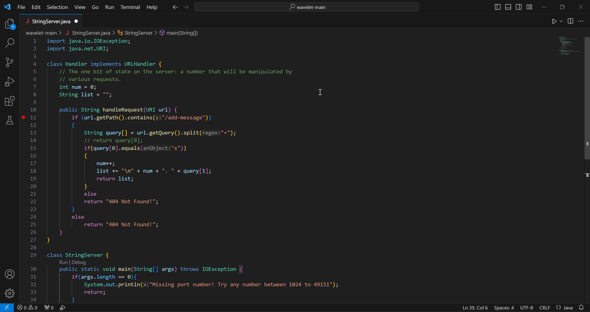
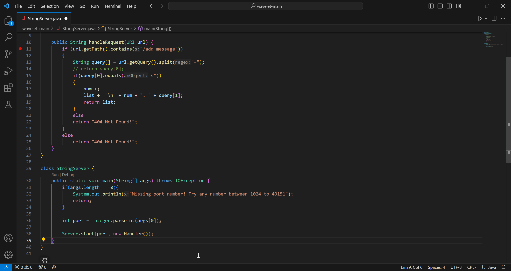
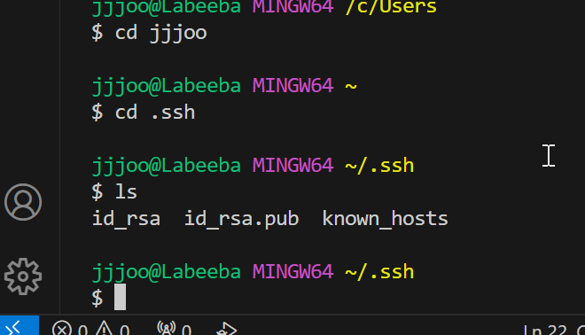
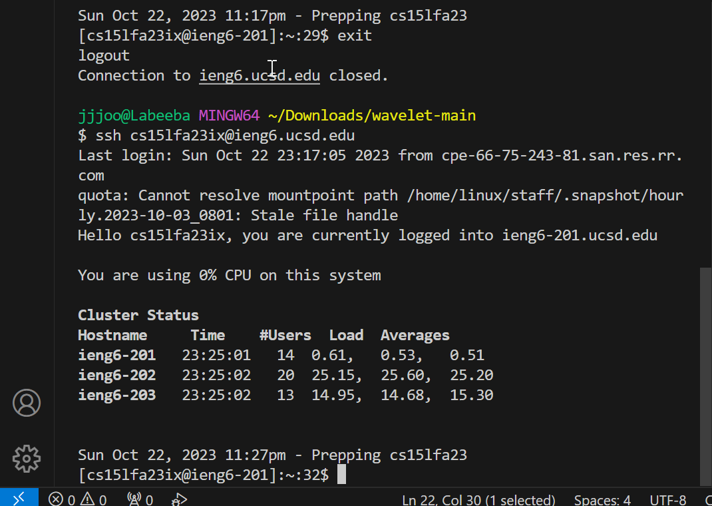

# Lab 3
## Part 1:
image 1:

the methods that were called(inside handleRequest):
getPath(): to get the path of the url /add-message?s=first
contains(): to check if the path contains /get_message
getQuery(): to get the query part of the url: s=first
split(): to split the url so that we can get the message (s, first)
equals(): to check if it has "s".

relevant arguments: we only need the url as an argument, as it contains all the information we need.
relevant fields: num: used to number the messages, only 1 in this case.
list: a string that is incremented with every new string.

nums changes from 0 to 1
list changes from "" to "\n 1. first"
As for the url, we are changing it manually.

image 2:

the methods that were called(inside handleRequest):
getPath(): to get the path of the url /add-message?s=second
contains(): to check if the path contains /get_message
getQuery(): to get the query part of the url: s=second
split(): to split the url so that we can get the message (s, second)
equals(): to check if it has "s".

relevant arguments: we only need the url as an argument, as it contains all the information we need.
relevant fields: num: used to number the messages
list: a string that is incremented with every new string.

nums changes from 1 to 2
list changes from "\n 1. first" to "\n 1. first \n 2. second"
As for the url, we are changing it manually.

## Part 2:
keys:

interaction without the password:

## Part 3:
I learned a lot about how urls are handled. I did not know about queries and paths in the url.
I had a vague idea about it, but I learned that a path in a url is an actual path to a file. 
I also leaned about keys and how to use them.
